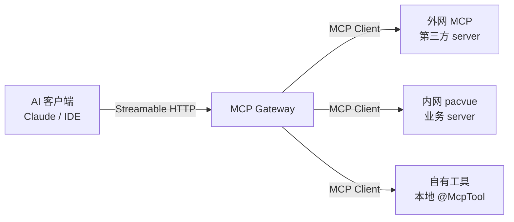

# MCP Gateway 能力清单（初版）

2026-09-21 · @Chneyang Song

技术栈：Spring Boot 4.1.1 + Spring AI 2.0.0 + JDK 25 LTS

## 定位与架构

网关是链路中唯一同时扮演两个角色的节点：对上游 AI 客户端它是一个 MCP Server，对下游各业务系统它是 MCP Client。上游只需要连一个端点，下游有多少个 server 对它透明。



网关自己也直接持有一部分 `@McpTool`，不必所有能力都来自下游——路由类元工具就属于这一层。

内外网两套部署的边界按下表划分，两套共用同一份代码，靠配置区分：

| 维度 | 外网实例 | 内网实例 |
| --- | --- | --- |
| 上游接入方 | 公网 AI 客户端 | 内部系统与员工 IDE |
| 可路由的下游 | 仅第三方公开 server | 全部，含 pacvue 内网 |
| 鉴权 | OAuth 2.0 | API Key + 内网 IP 白名单 |
| 出网能力 | 直连公网 | 经内网代理 |

两套实例之间不互相调用。外网实例需要内网数据时，走既有的 API 网关而不是 MCP 链路，避免把内网 server 的 tool schema 泄露到公网侧。

## 命名与路由规则

每个下游 server 分配一个全局唯一的**别名（alias）**，网关对外暴露的 tool 名一律为 `{alias}__{toolName}`，双下划线分隔。路由时按第一个 `__` 切分，前半查别名表，后半原样透传给下游。

别名约束：小写字母、数字与单下划线，首字符为字母，长度 2–16。不允许含 `__`，否则切分会歧义。

选双下划线而不是点号或斜杠，是因为部分 AI 客户端对 tool 名的字符集限制为 `[a-zA-Z0-9_-]`，点号会被拒。

### 冲突处理

加了命名空间后跨 server 重名不再可能，但还有两类冲突需要处理：

| 冲突类型 | 处理策略 |
| --- | --- |
| 两个 server 用了相同别名 | 启动时校验失败，直接 fail fast，不允许带病启动 |
| 拼接后超过客户端长度上限（通常 64） | 截断并追加 4 位哈希后缀，映射关系记入路由表 |
| 下游自身 tool 名含 `__` | 保留原名，只按第一个 `__` 切，不受影响 |

### 配置格式

别名到真实端点的映射放在 `application.yml`，初版不做动态注册：

```yaml
gateway:
  upstreams:
    - alias: ads
      url: http://pacvue-ads-mcp.internal/mcp
      transport: streamable-http
      auth: { type: api-key, header: X-Api-Key, value: ${ADS_MCP_KEY} }
      timeout: 10s
      enabled: true
    - alias: report
      url: http://pacvue-report-mcp.internal/mcp
      transport: streamable-http
      auth: { type: none }
      timeout: 30s
      enabled: true
```

上述配置下，客户端看到的就是 `ads__query_campaign`、`report__export_daily` 这类名字。

## 网关自有 Tool 清单

初版定义四个元工具，统一前缀 `gw__`。它们不访问业务数据，只回答“现在有什么能力可用”和“把这次调用送到哪里”。

| Tool | 用途 | 关键入参 |
| --- | --- | --- |
| `gw__list_servers` | 列出已接入的下游及健康状态 | 无 |
| `gw__list_tools` | 列出当前可调用的全部 tool | `server`、`keyword` |
| `gw__describe_tool` | 取单个 tool 的完整 JSON Schema | `name` |
| `gw__invoke` | 显式指定下游调用（逃生通道） | `server`、`tool`、`arguments` |

### gw\_\_list\_servers

无入参。返回数组，每项含 `alias`、`status`（`UP` / `DEGRADED` / `DOWN`）、`toolCount`、`lastProbeAt`。客户端通常在会话开头调一次，用于判断哪些能力域现在不可用。

### gw\_\_list\_tools

两个可选入参：`server`（按别名过滤）和 `keyword`（对 tool 名与描述做包含匹配）。返回每项只带 `name`、`server`、`description` 三个字段，**不带完整 schema**。

这个取舍是故意的：下游 tool 多了之后，全量 schema 会把客户端上下游窗口吃掉一大块。先给概览，需要时再取详情。

### gw\_\_describe\_tool

入参 `name`（带命名空间的全名，如 `ads__query_campaign`）。返回该 tool 的完整 `inputSchema`、`outputSchema` 与示例。配合上一个工具构成“先搜后查”的两步发现流程。

### gw\_\_invoke

入参 `server`、`tool`、`arguments`（对象）。作用是绕过名称拼接直接指定路由，用于两种场景：下游 tool 名被截断过，或者 tool 刚上线还没进入客户端的缓存列表。

它是逃生通道，不是主路径。正常情况下客户端应该直接调 `ads__query_campaign`，而不是绕一圈走 `gw__invoke`。

### 错误码

四个工具共用一套错误码，放在 MCP 错误响应的 `data.code` 里：

| 代码 | 含义 | 客户端应如何反应 |
| --- | --- | --- |
| `UPSTREAM_NOT_FOUND` | 别名不存在或已下线 | 重新调 `gw__list_servers` |
| `TOOL_NOT_FOUND` | 别名对但 tool 名不对 | 重新调 `gw__list_tools` |
| `UPSTREAM_TIMEOUT` | 下游超时 | 可重试一次，再失败则放弃 |
| `UPSTREAM_UNAUTHORIZED` | 凭证无效或过期 | 不要重试，提示人工处理 |
| `TOOL_FORBIDDEN` | 当前租户无权调用 | 不要重试 |
| `INVALID_ARGUMENTS` | 入参未通过 schema 校验 | 根据报错修正后重试 |

区分“可重试”与“不可重试”很重要。AI 客户端遇错天然倾向于改参数重试，如果鉴权失败不明确标成终态，它会反复撞同一堵墙。

## 下游透传 Tool 策略

默认**不全量透传**。每个下游必须在配置里声明白名单，没声明的 tool 不会出现在客户端列表里。理由是下游一次发版新增的 tool 不应该无声无息地成为网关对外能力。

```yaml
gateway:
  upstreams:
    - alias: ads
      tools:
        include: [query_campaign, list_campaigns]
        # 或者 include: ["*"] 显式全开，但必须手写
```

### Schema 改写

透传时只动两处，其余原样转发：

1. `name` 加上 `{alias}__` 前缀
2. `description` 末尾追加一句来源标注，如 `[via ads]`

`inputSchema` 一律不改。改写入参结构会让下游的校验报错对不上号，出了问题很难查。

### 缓存与刷新

下游 tool 列表在内存缓存，TTL 5 分钟。另外两个时机主动刷新：启动时全量拉一次；收到下游的 `notifications/tools/list_changed` 通知时刷对应那一个。

网关自身也要向上游发 `list_changed`，否则下游新增的能力要等客户端重连才能看到。

### 降级行为

单个下游挂掉不应该让整个网关不可用。按状态分三档：

| 下游状态 | tool 列表表现 | 调用行为 |
| --- | --- | --- |
| `UP` | 正常列出 | 正常转发 |
| `DEGRADED`（探活超时但未达熔断阈值） | 仍列出，用缓存快照 | 正常转发，失败计入熔断统计 |
| `DOWN`（熔断已开） | 从列表移除 | 直接返 `UPSTREAM_NOT_FOUND` |

熔断阈值初版定为：30 秒窗口内失败率超 50%且请求数 ≥ 5，进入 `DOWN`；半开启探活间隔 30 秒。

`DOWN` 时从列表移除而不是保留并报错，是因为 AI 客户端看到 tool 存在就会反复尝试，直接藏起来能让它更快改走其他路径。

## 鉴权与租户隔离

两条链路的鉴权方式不同，但经过同一个认证过滤器，最终都解析成一个统一的上下文对象：

```java
record CallerContext(
    String tenantId,      // 租户标识
    String principal,     // 调用方身份
    Set<String> scopes    // 权限范围
) {}
```

下游代码只认 `CallerContext`，不关心它是从 OAuth token 还是 API Key 解出来的。这是两套实例共用一份代码的关键。

### 两条链路的差异

|  | 外网实例 | 内网实例 |
| --- | --- | --- |
| 凭证形式 | OAuth 2.0 Bearer Token | `X-Api-Key` 请求头 |
| 验证方式 | Spring Security resource server 验 JWT | 查 Key 表，内存缓存 5 分钟 |
| 租户来源 | token 的 `tenant_id` claim | Key 绑定的租户 |
| 额外限制 | 无 | 内网 IP 段白名单 |

外网实例用 Spring Security 标准的 resource server 支持，不依赖 Spring AI 的 MCP Security 模块——后者当前还标着 Experimental，API 会变。

### 租户维度的可见性

同一个网关对不同租户暴露的 tool 集可以不同。规则在配置里按 scope 声明：

```yaml
gateway:
  upstreams:
    - alias: ads
      requiredScope: ads:read
    - alias: report
      requiredScope: report:export
```

`gw__list_tools` 返回前先按 `CallerContext.scopes` 过滤。没权限的 tool **直接不出现在列表里**，而不是出现但调用时报 403。两个好处：不泄露内部能力清单，也避免审计日志被无效尝试刷屏。

兼容起见 `gw__invoke` 仍保留 `TOOL_FORBIDDEN` 错误码，应对客户端缓存了旧列表的情况。

### 凭证注入下游

网关**不透传**上游凭证。调用下游时用网关自己的服务账号（配置里的 `auth` 节），原始调用方身份放在 `X-Gateway-Caller` 请求头里传给下游做审计。

这意味着下游信任网关已经做过鉴权。代价是网关成为安全边界上的单点，收益是不用把外部 token 格式传染给每个业务 server。

## 可观测性与流控

Spring AI 2.0 自带 Micrometer 埋点，网关在此基础上补两个自定义指标：

| 指标 | 类型 | 标签 | 用途 |
| --- | --- | --- | --- |
| `gateway.tool.calls` | Counter | `alias`、`tool`、`outcome` | 看哪些能力真被用了 |
| `gateway.upstream.latency` | Timer | `alias` | 定位慢在哪个下游 |
| `gateway.upstream.state` | Gauge | `alias` | 熔断器当前档位 |

`outcome` 只有三个值：`success` / `client_error` / `upstream_error`。不把具体错误码当标签，避免基数爆炸。

### 调用链

一次完整调用产生两层 span：网关入口一层，转发下游一层。traceId 通过 W3C `traceparent` 头透传给下游，让一次 AI 对话里的多次 tool 调用能在同一条链上看到。

日志里**不记录 `arguments` 完整内容**，只记字段名和值的长度。AI 传进来的参数可能含用户原始提问，属于敏感数据。

### 默认参数

| 项 | 初版取值 | 说明 |
| --- | --- | --- |
| 单次下游超时 | 10s（可按 alias 覆盖） | 报表类调长到 30s |
| 重试 | 仅连接失败重试 1 次 | 业务错误不重试 |
| 单租户限流 | 60 次/分钟 | 令牌桶，超出返回限流错误 |
| 单下游并发 | 20 | 隔离慢下游拖垂整体 |
| 响应体上限 | 1 MB | 超出截断并标记 |

重试只覆盖连接失败是有意为之。MCP tool 很多带副作用（创建、修改），网关无法判断幂等性，盲重试有重复执行风险。

响应体上限同样关键：下游返回一个几 MB 的报表，直接塞进模型上下游窗口会把会话撞爆。截断后应在响应里明确标出被截断，并提示改用分页参数。

## 骨架代码

四个关键类，职责不重叠：

```mermaid
flowchart TD
  A[GatewayMetaTools<br/>@McpTool 元工具] --> B[ToolRegistry<br/>路由表 + 缓存]
  B --> C[UpstreamClientPool<br/>下游连接管理]
  D[UpstreamProperties<br/>配置绑定] --> B
  D --> C
```

### 配置绑定

```java
@ConfigurationProperties("gateway")
public record GatewayProperties(List<Upstream> upstreams) {

    public record Upstream(
        String alias,
        String url,
        Duration timeout,
        String requiredScope,
        ToolFilter tools,
        boolean enabled
    ) {}

    public record ToolFilter(List<String> include) {}
}
```

### 路由注册器

```java
@Component
public class ToolRegistry {

    private final Map<String, Route> routes = new ConcurrentHashMap<>();

    record Route(String alias, String upstreamToolName, McpSchema.Tool schema) {}

    public void refresh(String alias, List<McpSchema.Tool> upstreamTools) {
        upstreamTools.stream()
            .filter(t -> allowed(alias, t.name()))
            .forEach(t -> routes.put(
                alias + "__" + t.name(),
                new Route(alias, t.name(), rewrite(alias, t))));
    }

    public Optional<Route> resolve(String exposedName) {
        return Optional.ofNullable(routes.get(exposedName));
    }
}
```

### 元工具实现

```java
@Service
public class GatewayMetaTools {

    private final ToolRegistry registry;
    private final UpstreamClientPool pool;

    @McpTool(name = "gw__list_servers",
             description = "列出已接入的下游 MCP Server 及其健康状态")
    public List<ServerInfo> listServers() {
        return pool.all().stream()
            .map(c -> new ServerInfo(
                c.alias(), c.state(), registry.countOf(c.alias()), c.lastProbeAt()))
            .toList();
    }

    @McpTool(name = "gw__list_tools",
             description = "列出当前可调用的 tool，可按 server 别名或关键词过滤")
    public List<ToolBrief> listTools(
            @McpToolParam(description = "server 别名，缺省返回全部", required = false)
            String server,
            @McpToolParam(description = "对 tool 名与描述做包含匹配", required = false)
            String keyword) {
        return registry.search(server, keyword, CallerContextHolder.current());
    }

    @McpTool(name = "gw__invoke",
             description = "显式指定下游 server 与 tool 发起调用")
    public Object invoke(
            @McpToolParam(description = "server 别名") String server,
            @McpToolParam(description = "不带前缀的 tool 名") String tool,
            @McpToolParam(description = "调用参数") Map<String, Object> arguments) {
        return pool.get(server)
            .orElseThrow(() -> new GatewayException("UPSTREAM_NOT_FOUND", server))
            .callTool(tool, arguments);
    }
}
```

### 透传部分

透传的下游 tool 不能用 `@McpTool` 注解——注解是编译期固定的，而透传列表运行时才知道。需要向 Spring AI 注册动态 `ToolSpecification`：

```java
@Bean
public List<McpServerFeatures.SyncToolSpecification> proxiedTools(
        ToolRegistry registry, UpstreamClientPool pool) {

    return registry.allRoutes().stream()
        .map(route -> new McpServerFeatures.SyncToolSpecification(
            route.schema(),
            (exchange, args) -> pool.get(route.alias())
                .orElseThrow()
                .callTool(route.upstreamToolName(), args)))
        .toList();
}
```

这里有个顺序问题需要在开发时验证：该 Bean 在启动时构建，但下游 tool 列表需要先连上才能拉到。若 Spring AI 2.0 不支持运行时增删 tool，则初版退一步：启动时同步拉取一次，后续变更靠 `gw__invoke` 兑现。

## 初版范围边界

MVP 目标是跑通一条完整链路：一个 AI 客户端连上网关，调到一个真实下游 server 的 tool 并拿到结果。

### 做

- [ ] 四个 `gw__` 元工具
- [ ] 静态配置的下游接入（YAML，支持 2–3 个 alias）
- [ ] 命名空间透传与白名单
- [ ] 内网实例的 API Key 鉴权
- [ ] 基本熔断与超时
- [ ] 三个 Micrometer 指标

### 不做

以下明确放到初版之后，写在这里是为了避免中途被要求加进来：

| 项 | 为什么往后放 |
| --- | --- |
| 外网 OAuth 2.0 链路 | 先验证内网链路跑通，鉴权形式不影响架构 |
| 下游动态注册（服务发现） | 配置文件能支撑到十几个下游 |
| MCP Resource 与 Prompt 透传 | 先只做 tool，它是需求量最大的 |
| 多租户 scope 过滤 | 内网实例初期只服务单一团队 |
| 响应结果缓存 | 缓存失效策略需要真实流量才能定 |

### 待确认

两个问题开工前需要先有答案：

1. **Spring AI 2.0 是否支持运行时增删 tool**。决定了透传列表能否热刷新，也决定 `list_changed` 通知有没有意义。需要先写个最小 demo 验证。
2. **首批接入哪几个下游**。目前文档里的 `ads` 和 `report` 是占位名，需要换成真实服务。

第一个问题建议先做：它的答案会反过来改变“透传部分”那段的实现方式，若不支持热更新，整个刷新机制都要简化。

## 参考

- [Spring AI 2.0.0 GA Available Now](https://spring.io/blog/2026/06/12/spring-ai-2-0-0-GA-available-now/)
- [MCP Server Boot Starter — Spring AI Reference](https://docs.spring.io/spring-ai/reference/api/mcp/mcp-server-boot-starter-docs.html)
- [Model Context Protocol — Spring AI Reference](https://docs.spring.io/spring-ai/reference/api/mcp/mcp-overview.html)
